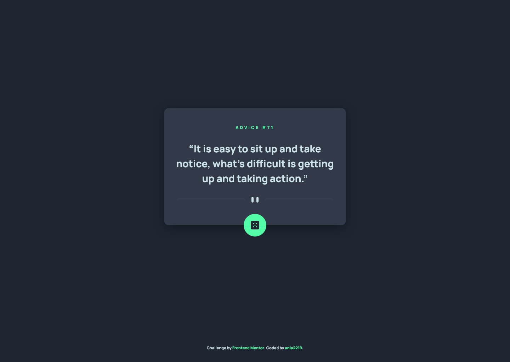

# Frontend Mentor - Advice generator app solution

This is a solution to the [Advice generator app challenge on Frontend Mentor](https://www.frontendmentor.io/challenges/advice-generator-app-QdUG-13db). Frontend Mentor challenges help you improve your coding skills by building realistic projects.

## Table of contents

- [Overview](#overview)
  - [The challenge](#the-challenge)
  - [Screenshot](#screenshot)
  - [Links](#links)
- [My process](#my-process)
  - [Built with](#built-with)
  - [What I learned](#what-i-learned)
  - [Continued development](#continued-development)
  - [Useful resources](#useful-resources)
- [Author](#author)

## Overview

### The challenge

Users should be able to:

- View the optimal layout for the app depending on their device's screen size
- See hover states for all interactive elements on the page
- Generate a new piece of advice by clicking the dice icon

### Screenshot




### Links

- Solution URL: [GitHub](https://github.com/ania221B/advice-generator-frontend-mentor)
- Live Site URL: [GitHub Pages](https://ania221b.github.io/advice-generator-frontend-mentor/)

## My process

### Built with

- Semantic HTML5 markup
- CSS custom properties
- CSS Grid
- Mobile-first workflow
- Vanilla JavaScript
- fetch API

### What I learned

The challenging part for me was error handling.

To handle errors, you need to write appropriate condition in first `then` call and also specify what you want to do/display in case of an error in a `catch` call that goes after all `then` calls:

```javascript
fetch(url)
  .then(response => {
    if (response.ok) return response.json()
    return Promise.reject(response)
  })
  .then(response => {
    // code for handling successful response
  })
  .catch(error => {
    // code for handling the error
  })
```

The API documentation states that if something goes wrong, you get a message object. Yet such object is returned in a successful response, so I handled that in `then` call.

But that did not cover all cases.

From what I could see, the response had no body when a network error occured (to get it I cut Internet access), so I added code for that scenario in `catch` call. In this case "Network error" info gets displayed.
In the `catch` call I also put code for any other errors, for which users get the code and message.
Unfortunately I wasn't able to think of anything better that asking users to check Internet connection or contact imaginary support.

Another thing that was a bit of a suprise, was how the app worked in Firefox. It seemed not to work. Once advice was sucessfully displayed, it did not change after clicking the button again. This is because of default cache behaviour. Successfully received data is stored in cache and retrieved from there. To make it work as expected, I added `cache` as an option to `fetch`:

```javascript
fetch(url, {
  cache: 'reload'
})
```

### Continued development

- Working with APIs
- Using fetch API
- Handling errors

### Useful resources

- [Documentation of Advice Slip JSON API](https://api.adviceslip.com/) - pretty much self-explanatory. Website where you can find out how the API works and how to use it.
- [MDN article on fetch](https://developer.mozilla.org/en-US/docs/Web/API/fetch) - it contains info about other options that can be used in `fetch`.
- [MDN article on cache option](https://developer.mozilla.org/en-US/docs/Web/API/Request/cache) - all possible values of `cache` property are explained here.
- [Kevin Powell's video on focus-visible](https://www.youtube.com/watch?v=zT9Ftmw0-uc) - a short video with useful info about focus-visible and other cool stuff.

## Author

- Frontend Mentor - [@ania221B](https://www.frontendmentor.io/profile/ania221b)
